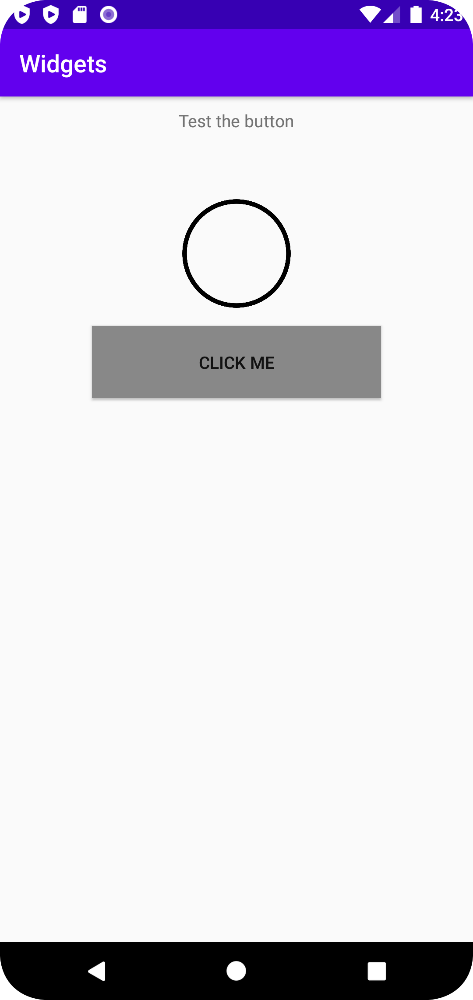
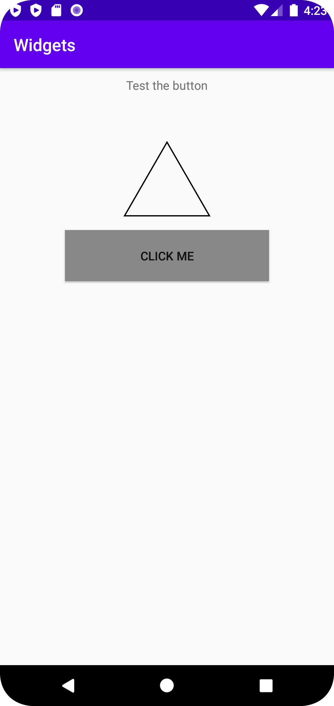

# Rapport

En app för att klicka på en knapp som ändrar vilken form som visas.

TextView som visar texten "Test the button"

```xml
<TextView
    android:layout_marginTop="10dp"
    android:textAlignment="center"
    android:layout_gravity="center_horizontal"
    android:layout_width="240dp"
    android:layout_height="60dp"
    android:text="@string/text_view" />
```

ImageView för cirkel samt triangle.

```xml
<ImageView
    android:src="@drawable/circle"
    android:layout_width="match_parent"
    android:layout_height="120dp"
    android:id="@+id/triangleShow"/>
<ImageView
    android:src="@drawable/triangle"
    android:layout_width="match_parent"
    android:layout_height="120dp"
    android:id="@+id/circleShow"/>
```

Button för att ändra bilden. Knappen inkluderar texten "Click me", samt en onClick för att
kunna manipulera bilden.

```xml
<Button
    android:layout_gravity="center_horizontal"
    android:layout_width="240dp"
    android:layout_height="60dp"
    android:background="#888"
    android:text="Click me"
    android:onClick="toggle" />
```

Inkluderar 2 variabler, triangle och circle för att bestämma vilken som ska kunna visas.

```java
private ImageView triangle;
private ImageView circle;
```

Metod för som använder sig utav onClick för att kunna ändra på bilden.

```java
public void toggle(View view) {
    if (triangle.getVisibility() == View.VISIBLE){
        triangle.setVisibility(View.GONE);
        circle.setVisibility(View.VISIBLE);
    }
    else{
        circle.setVisibility(View.GONE);
        triangle.setVisibility(View.VISIBLE);
    }
}
```




